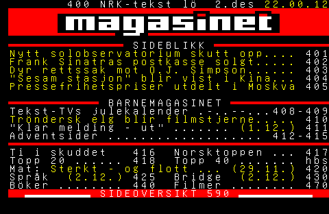

# Teletext Archive
A collection of teletext pages from different broadcasters. These pages have been recovered primarily from tape-based media like VHS and Betamax.

### Relevant links

For extra content such as image files and raw T42 stream files, please visit my [Archive page](https://archive.org/details/ddybing-teletext-archive). That page also has a full mirror of the contents of this GitHub repository.

#### Tools

QTeletextMaker - https://github.com/gkthemac/QTeletextMaker

vhs-decode - https://github.com/oyvindln/vhs-decode

Teletext Meddler - https://andrewnile.co.uk/software/

vhs-teletext - https://github.com/ali1234/vhs-teletext

